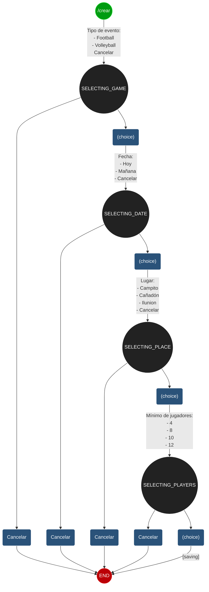

```mermaid
flowchart TB
    %% Documentation: https://mermaid-js.github.io/mermaid/#/flowchart
    A(("/crear")):::entryPoint --> |Tipo de evento: <br /> - Football <br /> - Volleyball <br /> Cancelar| B((SELECTING_GAME)):::state
    B --> C("(choice)"):::userInput
    B --> D("Cancelar"):::userInput
    D --> End(("END")):::termination
    C --> |Fecha: <br /> - Hoy <br /> - Mañana <br /> - Cancelar| E(("SELECTING_DATE")):::state
    E --> F("(choice)"):::userInput
    E --> G("Cancelar"):::userInput
    G --> End
    F --> |Lugar: <br /> - Campito <br /> - Cañadón <br /> - Ilunion <br /> - Cancelar| H((SELECTING_PLACE)):::state
    H --> I("(choice)"):::userInput
    H --> J("Cancelar"):::userInput
    J --> End
    I --> |Mínimo de jugadores: <br /> - 4 <br /> - 8 <br /> - 10 <br /> - 12| K((SELECTING_PLAYERS)):::state
    K --> L("(choice)"):::userInput
    K --> M("Cancelar"):::userInput
    M --> End
    L --> |"[saving]"| End
    classDef userInput  fill:#2a5279, color:#ffffff, stroke:#ffffff
    classDef state fill:#222222, color:#ffffff, stroke:#ffffff
    classDef entryPoint fill:#009c11, stroke:#42FF57, color:#ffffff
    classDef termination fill:#bb0007, stroke:#E60109, color:#ffffff
```
