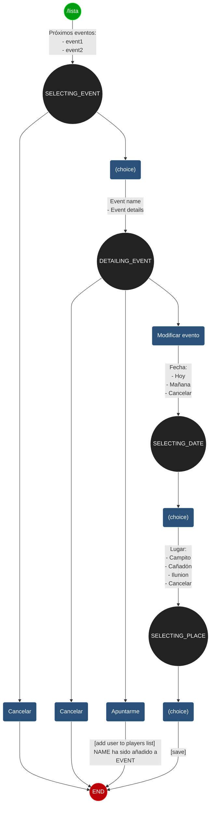

```mermaid
flowchart TB
    %% Documentation: https://mermaid-js.github.io/mermaid/#/flowchart
    A(("/lista")):::entryPoint --> |Próximos eventos: <br /> - event1 <br /> - event2| B(("SELECTING_EVENT")):::state
    B ---> C("(choice)"):::userInput
    B ---> D("Cancelar"):::userInput
    D ---> End(("END")):::termination
    C ---> |Event name <br /> - Event details| E(("DETAILING_EVENT")):::state
    E ---> F("Modificar evento"):::userInput
    E ---> G("Apuntarme"):::userInput
    E ---> H("Cancelar"):::userInput
    H ---> End
    G ---> |"[add user to players list] <br /> NAME ha sido añadido a EVENT"| End
    F ---> |Fecha: <br /> - Hoy <br /> - Mañana <br /> - Cancelar| I(("SELECTING_DATE")):::state
    I ---> J("(choice)"):::userInput
    J ---> |Lugar: <br /> - Campito <br /> - Cañadón <br /> - Ilunion <br /> - Cancelar| L(("SELECTING_PLACE")):::state
    L ---> M("(choice)"):::userInput
    M ---> |"[save]"| End
    classDef userInput fill:#2a5279, color:#ffffff, stroke:#ffffff
    classDef state fill:#222222, color:#ffffff, stroke:#ffffff
    classDef entryPoint fill:#009c11, stroke:#42FF57, color:#ffffff
    classDef termination fill:#bb0007, stroke:#E60109, color:#ffffff
```
